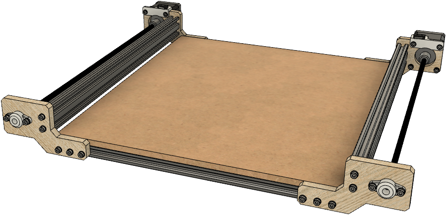

# CNC

  

 

I have always wanted to be able to work with more materials than just plastic. Hence, the idea of building a CNC machine arose. The machine is mainly composed of wood, 3D-printed parts, and aluminum profiles.

A demonstration of the machine is found below.
1. [x-, y-axis movement](https://youtu.be/SKr2g4cNDo0)
1. [z-axis movement](https://youtu.be/zbdB29ODgsI)
1. [x-, y-, and z-axis movement](https://youtu.be/WUcssfh0N9U)

## x-Axis
The x-axis consists of stepper motors, leadscrews, limit switches, and bearing blocks. The leadscrew converts the rotary motion of the stepper motors to linear motion, which drives the y-axis.

  

## y-Axis
The y-axis consists of a stepper motor, leadscrew, bearing block, and a limit switch. It connects to the x-axis via two leadscrew nuts, which are mounted in a 3D-printed housing. It has four V-wheels that slide on the aluminum profile mounted on the x-axis. 

  

## z-Axis
The z-axis consists of a motor, leadscrew, linear rails, and a bearing block. The motor connects to the lead screw by a timing belt. A carriage is mounted on the leadscrew, which can move moves up and down.  

  

